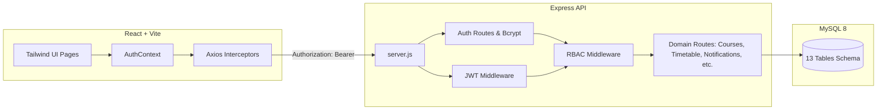

# 🎓 UniLearn — University Learning Management System (LMS)

A full-stack Learning Management System built with **React**, **Vite**, **Tailwind CSS**, **Node.js**, **Express**, and **MySQL 8+**, featuring **bcrypt password hashing**, **JWT authentication**, and **Role-Based Access Control (RBAC)**.

---

## 🚀 System Architecture



---

## 🔐 Security Features

1. **Password Hashing**: Bcrypt with 12 salt rounds — no plain-text passwords stored or compared.
2. **Stateless JWT Tokens**: Signed with environment secret (`JWT_SECRET`) and expiring in 7 days (`JWT_EXPIRES_IN`).
3. **Protected Endpoints**: Verified via `authMiddleware` on all secured routes.
4. **Role-Based Access Control (RBAC)**: Fine-grained access control protecting sensitive endpoints (e.g. instructors/admins for creating courses/assignments and grading).
5. **Axios Interceptor**: Automatically attaches the JWT Bearer token to all outgoing requests and auto-redirects on 401s.
6. **Environment Separation**: All database credentials and secrets stored in `server/.env`.

---

## 👥 Demo Accounts

The database is pre-seeded with realistic data across students, instructors, and admins:

| Role | Email | Password | Description |
|------|-------|----------|-------------|
| **Student** | `aanya.sharma@university.edu` | `password123` | CS 5th Semester Student |
| **Instructor** | `r.mehta@university.edu` | `password123` | Professor, DBMS & Systems |
| **Instructor** | `p.nair@university.edu` | `password123` | Associate Professor, Machine Learning |
| **Admin** | `admin@example.com` | `password123` | System Administrator |

> 💡 **Quick Login**: The login screen features 1-click demo access buttons and autofill credential chips.

---

## 🛠️ Getting Started

### 1. Database Setup & Seeding

Ensure MySQL is running on port `3306`:

```bash
cd server
npm install
node seed.js
```

This will automatically create the `lms` database, build all 13 tables, hash passwords with bcrypt, and populate courses, enrollments, timetables, notifications, assignments, and grades.

### 2. Start the Backend API

```bash
cd server
npm run dev
# or: node server.js
```
The server will run at `http://localhost:5000`.

### 3. Start the Frontend Application

```bash
npm install
npm run dev
```
Open `http://localhost:5173` in your browser.

---

## 📡 API Endpoints

### Authentication (`/api/auth`)
- `POST /api/auth/register` — Register a new student or instructor
- `POST /api/auth/login` — Authenticate and receive a JWT token + profile
- `GET  /api/auth/me` — Verify token and retrieve current user session

### Courses (`/api/courses`)
- `GET  /api/courses` — List all courses (authenticated)
- `GET  /api/courses/:id` — Course details and study resources
- `POST /api/courses` — Create new course (Instructor/Admin only)

### Timetable (`/api/timetable`)
- `GET  /api/timetable` — Weekly class schedule with rooms and times

### Notifications & Announcements (`/api/notifications`)
- `GET   /api/notifications` — User-specific notifications
- `GET   /api/notifications/announcements` — System & course announcements
- `PATCH /api/notifications/:id/read` — Mark a notification as read

### Assignments (`/api/assignments`)
- `GET  /api/assignments` — List assignments
- `POST /api/assignments` — Create assignment (Instructor/Admin only)
- `POST /api/assignments/:id/submit` — Submit work (Student only)

---

## 📂 Project Structure

```
lms-frontend/
├── server/
│   ├── config/
│   │   └── db.js            # MySQL connection pool
│   ├── middleware/
│   │   ├── auth.js          # JWT verification middleware
│   │   └── rbac.js          # Role-based access control middleware
│   ├── routes/
│   │   ├── auth.js          # Register, login, me endpoints
│   │   ├── courses.js       # Course management
│   │   ├── assignments.js   # Assignments & submissions
│   │   ├── timetable.js     # Class schedules
│   │   ├── notifications.js # Notifications & announcements
│   │   └── users.js         # Users & student lists
│   ├── schema.sql           # Complete MySQL DDL (13 tables)
│   ├── seed.js              # Database seed script with bcrypt hashing
│   ├── server.js            # Express application entry point
│   └── .env                 # Environment secrets
├── src/
│   ├── api/
│   │   └── axios.js         # Central Axios client with JWT interceptor
│   ├── context/
│   │   ├── AuthContext.jsx  # Authentication state & methods
│   │   └── ThemeContext.jsx # Theme provider
│   ├── pages/
│   │   ├── auth/Login.jsx   # Sign in & registration with demo shortcuts
│   │   ├── student/         # Student portal (Dashboard, Courses, Timetable, etc.)
│   │   └── teacher/         # Instructor portal (Dashboard, Courses, Grading, etc.)
│   └── components/          # Reusable UI components & layouts
└── package.json
```
